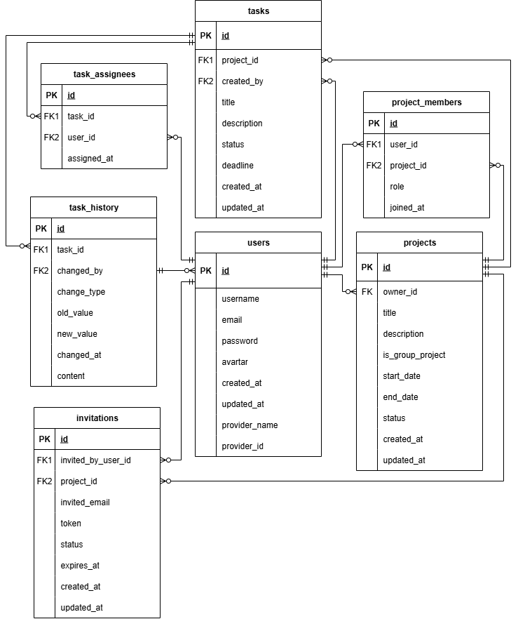
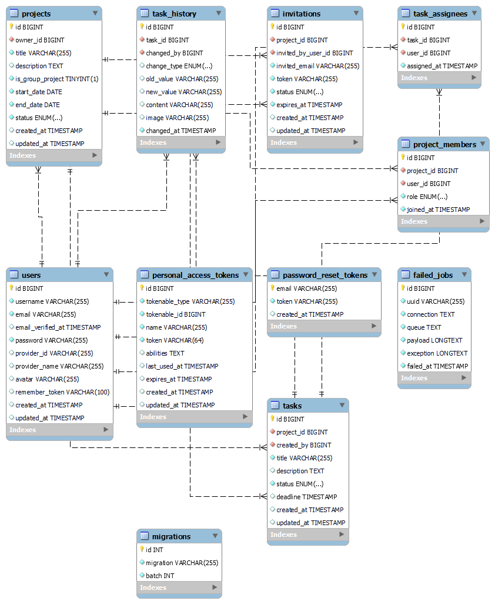

# ✅ Giới thiệu dự án DONEZO - TodoList Management

## 📌DEMO

* **Link website**: https://donezo-vue.netlify.app/

### ✨Tài khoản thử nghiệm

1. **Leader:**

```
email: thuytien.hoctap@gmail.com
password: Thuytien965002@
```

## 📌 Mô tả

* **DONEZO** là một web quản lý công việc, hỗ trợ cả **dự án cá nhân** và **dự án nhóm**. Giao diện và trải nghiệm được tham khảo từ các nền tảng quản trị công việc **Odoo,** sau đó được tối ưu và xây dựng lại để phù hợp với mục tiêu học tập.

---

## 🗂️ Cấu trúc dự án

Dự án được chia thành 2 phần chính:

* **Backend** : API phát triển bằng **Laravel** cung cấp dữ liệu cho frontend.
* **Frontend** : Giao diện web được xây dựng bằng **VueJS.**

---

## ⚙️ Công nghệ & Dịch vụ hỗ trợ

* **Laravel** : Xây dựng RESTful API, xử lý nghiệp vụ backend.
* **VueJS**: Framework frontend hiện đại, dễ dàng mở rộng.
* **MySQL**: Lưu trữ thông tin người dùng, dự án, task, lịch sử thay đổi.
* **Pusher**: Theo dõi **lịch sử thay đổi** của task.

---

## ✨ Các tính năng

### 👤 Chức năng người dùng

* Đăng ký / Đăng nhập bằng **Google**, **Github** và khôi phục mật khẩu qua email.
* Quản lý **dự án cá nhân** hoặc tham gia **dự án nhóm**.
* Xem danh sách công việc theo **trạng thái**: Việc cần làm, Phân tích, Thực hiện...
* Tạo task mới, chỉnh sửa, thay đổi deadline, gán nhiều người cùng thực hiện.
* Theo dõi **lịch sử thay đổi chi tiết** của mỗi task (ai thay đổi, thay đổi gì, khi nào).
* Chế độ **sáng/tối**.

### 👨‍💼 Chức năng quản lý dự án (Owner)

* Tạo và quản lý **dự án nhóm**.
* Mời thành viên vào dự án qua email.
* Phân quyền **Owner / Member**.
* Quản lý task trong dự án: thêm, phân công, chỉnh sửa, xoá.
* Xem **báo cáo tiến độ** của dự án.

---

## ✨ ERD - Database Diagram





---

## 🚀 Hướng dẫn cài đặt & chạy dự án

### 1. Yêu cầu môi trường

* **PHP** : 8.2+
* **Composer** : Quản lý gói Laravel
* **Node.js** : 16+
* **Database** : MySQL
* **Web Server** : Nginx hoặc Apache

### 2. Hướng dẫn cài đặt

Thực hiện các bước bổ sung sau khi đã clone repository:

# Clone repository

```
git clone https://github.com/thuytien157/donezo-task-management.git
```

# Cài đặt Backend (Server)

```
composer install
```

Mở tệp `.env.example`, đổi tên tệp thành `.env`, và điền các thông tin sau:

```
MAIL_MAILER=smtp
MAIL_HOST=smtp.gmail.com
MAIL_PORT=587
MAIL_USERNAME=tieenz.work@gmail.com
MAIL_PASSWORD=pylgdukvuwukcsdi
MAIL_ENCRYPTION=tls
MAIL_FROM_ADDRESS=tieenz.work@gmail.com

PUSHER_APP_ID=thông tin này lấy từ dashboard của Pusher
PUSHER_APP_KEY=thông tin này lấy từ dashboard của Pusher
PUSHER_APP_SECRET=thông tin này lấy từ dashboard của Pusher
PUSHER_HOST=
PUSHER_PORT=443
PUSHER_SCHEME=https
PUSHER_APP_CLUSTER=ap1

GOOGLE_CLIENT_ID=thông tin này lấy từ ggclound
GOOGLE_CLIENT_SECRET=thông tin này lấy từ ggclound
GOOGLE_REDIRECT_URI=url callback được cài đặt từ ggclound

GITHUB_CLIENT_ID=thông tin này lấy từ phần setting/developer của git
GITHUB_CLIENT_SECRET=thông tin này lấy từ phần setting/developer của git
GITHUB_REDIRECT_URI=url callback được cài đặt từ git

```

* **PUSHER_APP_ID, PUSHER_APP_KEY, PUSHER_APP_SECRET, PUSHER_APP_CLUSTER**: Bạn truy cập `https://dashboard.pusher.com`/ để đăng ký. Sau đó, bạn copy nội dung vào.
* **GOOGLE_CLIENT_ID, GOOGLE_CLIENT_SECRET, GOOGLE_REDIRECT_URI**: Bạn truy cập `https://console.cloud.google.com/` để đăng ký. Sau đó, bạn copy nội dung vào.
* **GITHUB_CLIENT_ID, GITHUB_CLIENT_SECRET, GITHUB_REDIRECT_URI**: Bạn truy cập `https://github.com/settings/developers` để đăng ký. Sau đó, bạn copy nội dung vào.

Chỉnh sửa file .env để cấu hình database và các dịch vụ khác

```
php artisan migrate --seed
php artisan serve
php artisan queue:work
```

# Cài đặt Frontend (Client)

```
npm install
```

Mở tệp `.env.example`, đổi tên tệp thành `.env`, và điền các thông tin sau:

```
VITE_PUSHER_APP_KEY=thông tin này lấy từ dashboard của Pusher
VITE_PUSHER_CLUSTER=ap1
```
